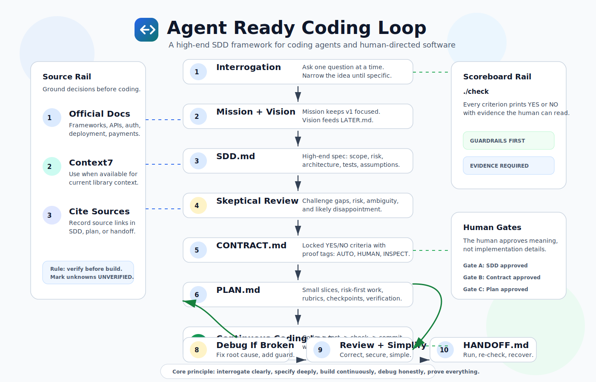

# Agent Ready Coding Loop

**A spec-driven coding-agent framework for turning plain-language ideas into verified software.**

Agent Ready Coding Loop is a reusable workflow for Claude Code, Codex, ChatGPT, Cursor, Gemini, Mimo, and other coding agents. It is designed for beginner and intermediate humans who want professional-grade software without needing to read code to manage the project.



The framework teaches agents to do the work a strong senior engineer would do before, during, and after coding:

- interrogate the idea until it is specific;
- define the mission and vision;
- write a high-quality SDD;
- convert the SDD into locked success criteria;
- plan small verified implementation slices;
- keep coding while the continuation rubric says it is safe;
- stop and debug when broken;
- verify everything through a human-readable scoreboard;
- review, simplify, and hand off the project.

## Why This Exists

Most AI coding failures are not caused by bad syntax. They are caused by weak project definition:

- vague goals;
- missing constraints;
- no success criteria;
- no durable plan;
- no debugging discipline;
- no proof that the final result matches what the human meant.

Agent Ready Coding Loop fixes that by making the agent create durable project artifacts before and during the build.

The human does not need to inspect code. The human controls the work through:

- `SDD.md`: the shared understanding;
- `CONTRACT.md`: the locked definition of done;
- `PLAN.md`: the implementation path;
- `./check`: the proof command;
- `HANDOFF.md`: the run, recovery, and maintenance guide.

## The Theory

This repo is built around one idea:

> A beginner should not have to become technical to direct a technical project. The agent must translate the human's goal into professional engineering artifacts, then use those artifacts as guardrails while coding.

The loop combines several practices now common across modern agentic coding workflows:

- **Spec-driven development**: create a durable spec before code.
- **Context-driven development**: keep persistent files agents can reload across sessions.
- **Contract-driven verification**: define YES/NO success criteria before building.
- **Continuous agent loops**: let the agent keep coding while safe instead of pausing after every tiny step.
- **Stop-the-line debugging**: stop feature work when anything breaks.
- **Doubt-driven review**: challenge specs, contracts, and non-trivial decisions before they stand.
- **Source-grounded implementation**: use official docs and Context7 when available for current framework/API context.

For a deeper explanation, see [docs/THEORY.md](docs/THEORY.md).

## Acknowledgements

This framework was informed by public agentic-coding practices and prior work, including Addy Osmani's [`agent-skills`](https://github.com/addyosmani/agent-skills) repository and official guidance from OpenAI, Anthropic, Cursor, Google Gemini CLI, and Context7.

See [ACKNOWLEDGEMENTS.md](ACKNOWLEDGEMENTS.md) for citations and relationship notes.

## Quick Start

Point your coding agent at this repo and say:

```text
Follow these instructions when making any project or coding project.
```

If your agent does not automatically read repo instructions, paste the contents of `PROMPT.md` as the first message.

## The v2.4 Workflow

```text
Interrogation
-> Mission and vision
-> SDD.md
-> Skeptical SDD review
-> CONTRACT.md
-> PLAN.md
-> Continuous build/check loop
-> Debug loop when broken
-> Review and simplification
-> HANDOFF.md
```

## What The Agent Creates

| File | Purpose |
|---|---|
| `SDD.md` | The high-end spec-driven development document |
| `CONTRACT.md` | Locked YES/NO success criteria and proof plan |
| `PLAN.md` | Ordered tasks, risks, checkpoints, and rubrics |
| `LATER.md` | Good ideas postponed out of version 1 |
| `DEBUG.md` | Non-trivial debugging evidence and root-cause notes |
| `STUCK.md` | A blocker report with one non-technical human question |
| `HANDOFF.md` | Run guide, re-check guide, recovery recipe, and maintenance notes |
| `./check` | One command that prints the project scoreboard |

## The Continuous Coding Rubric

The agent keeps coding if:

- at least one contract criterion is still NO;
- the next step is inside the approved SDD and contract;
- the next slice targets no more than 1-3 criteria;
- the verification method is known before coding;
- no hard guardrail is failing;
- the same failure has not repeated twice;
- no new human decision is needed;
- scope, cost, data use, and risk do not change.

The agent stops feature work and debugs if:

- a test fails;
- the build breaks;
- runtime behavior differs from expected behavior;
- a previously YES criterion turns NO;
- the root cause is unclear.

This is what lets the loop keep moving without constantly asking the human for permission.

## Compatible Agents

This repo includes thin compatibility pointers for:

- Claude Code: `CLAUDE.md`
- Gemini CLI: `GEMINI.md`
- ChatGPT / Codex: `CHATGPT.md`
- Mimo: `MIMO.md`
- Cursor: `.cursor/rules/agent-ready-loop.mdc`
- Generic agents: `GENERIC_AGENT.md`

All compatibility files point back to `AGENTS.md`, which is the source of truth.

## Repo Structure

```text
.
├── AGENTS.md
├── PROMPT.md
├── README.md
├── ACKNOWLEDGEMENTS.md
├── USE_WITH_ANY_AGENT.md
├── CLAUDE.md
├── GEMINI.md
├── CHATGPT.md
├── MIMO.md
├── GENERIC_AGENT.md
├── .cursor/rules/agent-ready-loop.mdc
├── docs/
│   ├── THEORY.md
│   └── IMPLEMENTATION_MODEL.md
└── templates/
    ├── SDD.md
    ├── CONTRACT.md
    ├── PLAN.md
    ├── DEBUG.md
    ├── STUCK.md
    ├── HANDOFF.md
    └── LATER.md
```

## Who This Is For

Use this framework if:

- you are a beginner who wants an agent to build software without guessing;
- you are an intermediate builder who wants stronger specs and tests;
- you are making repeatable agent workflows;
- you are building with multiple coding agents;
- you want agents to keep working safely after success criteria are defined.

## What Makes It Different

Many prompts tell agents to "build an app." This framework tells agents how to run the whole project:

- ask better questions;
- write the SDD;
- challenge the SDD;
- lock the contract;
- plan small slices;
- code continuously while safe;
- debug systematically;
- prove progress through a scoreboard;
- hand off the result so another agent can resume later.

## Status

Current version: **v2.4 - High-End SDD Agent Loop**

This version adds:

- one-question-at-a-time interrogation mode;
- mission and vision;
- `SDD.md` as the main spec artifact;
- skeptical SDD and contract reviews;
- Context7 source-check guidance;
- continuous coding rubric;
- debugging, ask-human, stuck, and handoff rubrics;
- compatibility instructions for major coding agents;
- reusable templates.

## Contributing

Contributions are welcome. See [CONTRIBUTING.md](CONTRIBUTING.md).

The highest-value contributions are:

- better rubrics;
- better templates;
- compatibility notes for more agents;
- examples of completed projects using the loop;
- improvements that make the framework clearer for beginners without weakening engineering rigor.
